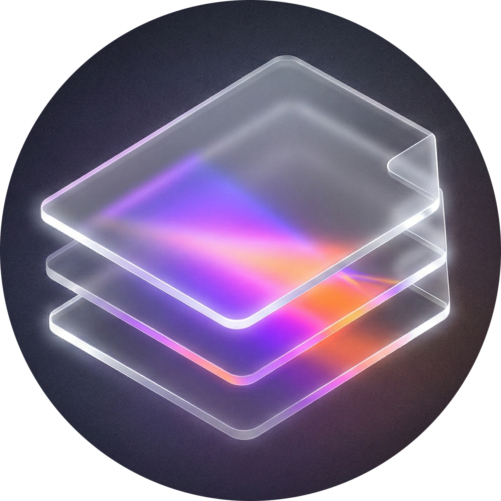

# 📄 Glass PDF Editor

> **Minimal. Secure. Serverless.**
> A powerful, browser-based PDF manipulation tool built with a futuristic Glassmorphism UI.



## 🚀 Live Demo
Check out the live application here: **[Glass PDF Editor](https://priyanshrajbhar.vercel.app/)**

---

## 📖 About Project

**Glass PDF Editor** is a modern web application designed to edit, merge, split, and secure PDF files directly in the browser.

The core philosophy of this project is **Privacy**. It utilizes a fully **Serverless Client-Side Architecture**, meaning files are processed entirely within the user's device and are **never uploaded** to any server. This ensures 100% data security and privacy.

The interface is crafted using the **Glassmorphism** design language, offering a premium, clean, and futuristic user experience.

---

## 🛠️ Tech Stack

This project leverages the latest and most efficient web technologies:

* **Framework:** [Next.js 16 (App Router)](https://nextjs.org/) - The React Framework for the Web.
* **Styling:** [Tailwind CSS](https://tailwindcss.com/) - Utility-first CSS framework for modern styling.
* **Animations:** [Framer Motion](https://www.framer.com/motion/) - For smooth transitions and interactive hover effects.
* **PDF Logic:** [pdf-lib](https://pdf-lib.js.org/) - For creating and modifying PDF documents in JavaScript.
* **PDF Rendering:** [react-pdf](https://github.com/wojtekmaj/react-pdf) - For rendering PDF pages within the browser.
* **Drag & Drop:** [@hello-pangea/dnd](https://github.com/hello-pangea/dnd) - For intuitive drag-and-drop reordering of files.
* **Signature:** [react-signature-canvas](https://github.com/agilgur5/react-signature-canvas) - For capturing digital signatures via touch or mouse.
* **PWA:** [@ducanh2912/next-pwa](https://github.com/DuCanhGH/next-pwa) - For making the application installable and offline-ready.
* **Notifications:** [react-hot-toast](https://react-hot-toast.com/) - For non-intrusive, beautiful toast notifications.
* **Language:** TypeScript - For type safety and robust code quality.

---

## ✨ Features

A comprehensive suite of tools designed for professional document management:

1.  **📄 Merge PDF:** Combine multiple PDF files into one. Includes drag-and-drop functionality to reorder files before merging.
2.  **✂️ Split PDF:** Extract specific page ranges (e.g., "1-5, 8") from a large document.
3.  **🖼️ Image to PDF:** Convert JPG/PNG images into a single PDF document.
4.  **✍️ e-Sign PDF:** Draw digital signatures and embed them onto documents.
5.  **🔒 Protect PDF:** Encrypt documents with passwords using AES-256 encryption.
6.  **💧 Watermark:** Apply custom text overlays/watermarks diagonally across pages.
7.  **🔢 Page Numbers:** Automatically add "1 of X" pagination to the footer of every page.
8.  **⚡ Compress PDF:** Optimize file structure to reduce file size.
9.  **🔄 Rotate:** Rotate pages by 90-degree increments.
10. **📱 PWA Support:** Fully installable as a native app on Desktop and Mobile with offline capabilities.

---

## 📅 Development Journey

The project was built using an iterative development approach to ensure stability and performance:

### Phase 1: UI & Architecture 🎨
* Established the **Glassmorphism Theme** (Dark mode, blurred backdrops, gradients).
* Implemented a responsive Grid Layout for seamless mobile and desktop experiences.
* Configured Tailwind CSS for custom color palettes and animations.

### Phase 2: Core Logic Implementation 🧠
* Integrated **`pdf-lib`** for client-side binary manipulation.
* Developed modular functions (`rotatePDF`, `mergePDFs`) utilizing `ArrayBuffer` processing.
* Implemented `downloadjs` for handling file outputs in the browser.

### Phase 3: Smart PDF Viewer 👁️
* Created a **Custom PDF Viewer** using `react-pdf`.
* Designed a Floating/Fixed Toolbar for **Zoom In/Out**, **Fit Width**, and **Page Navigation**.
* Optimized rendering performance using CSS transformations to prevent re-renders during zooming.

### Phase 4: Advanced Features 🚀
* **Drag & Drop:** Implemented complex reordering logic for the Merge tool.
* **Signature Pad:** Integrated a canvas drawing tool for capturing and embedding signatures.
* **Multi-format Support:** Added logic to handle and convert image inputs seamlessly.

### Phase 5: Bug Fixes & Optimization 🐛
Addressed critical challenges during development:
* **Fixed:** Resolved `pdfDoc.encrypt` version mismatch by forcing specific library versions.
* **Fixed:** Solved `react-pdf` toolbar visibility/flickering issues using Z-index layering and state management.
* **Fixed:** Resolved PWA Build Errors (Next.js 16 Turbopack conflict) by utilizing the `--webpack` flag.
* **Fixed:** Corrected TypeScript definitions for third-party modules (`downloadjs`).

---

## ⚙️ Installation (Local Setup)

To run this project locally on your machine:

1.  **Clone the Repository:**
    ```bash
    git clone [https://github.com/priyansh-86/pdf-glass-editor.git](https://github.com/priyansh-86/pdf-glass-editor.git)
    cd pdf-glass-editor
    ```

2.  **Install Dependencies:**
    ```bash
    npm install
    ```

3.  **Run Development Server:**
    ```bash
    npm run dev
    ```

4.  **Open Browser:**
    Navigate to `http://localhost:3000`

---

## 🤝 Connect with Developer

Built with ❤️ by **Priyansh**.

* 🌐 **Portfolio:** [https://priyanshrajbhar.vercel.app/](https://priyanshrajbhar.vercel.app/)
* 🐙 **GitHub:** [@priyansh-86](https://github.com/priyansh-86)
* 📸 **Instagram:** [@priyansh__.86](https://instagram.com/priyansh__.86)
* 🐦 **X (Twitter):** [@priyansh_86](https://x.com/priyansh_86)
* ✈️ **Telegram:** [@priyansh_dev](https://t.me/priyansh_dev)
* 📧 **Email:** [priyanshrajbhar499@gmail.com](mailto:priyanshrajbhar499@gmail.com)

---

### 📜 License
This project is open-source and available under the **MIT License**.